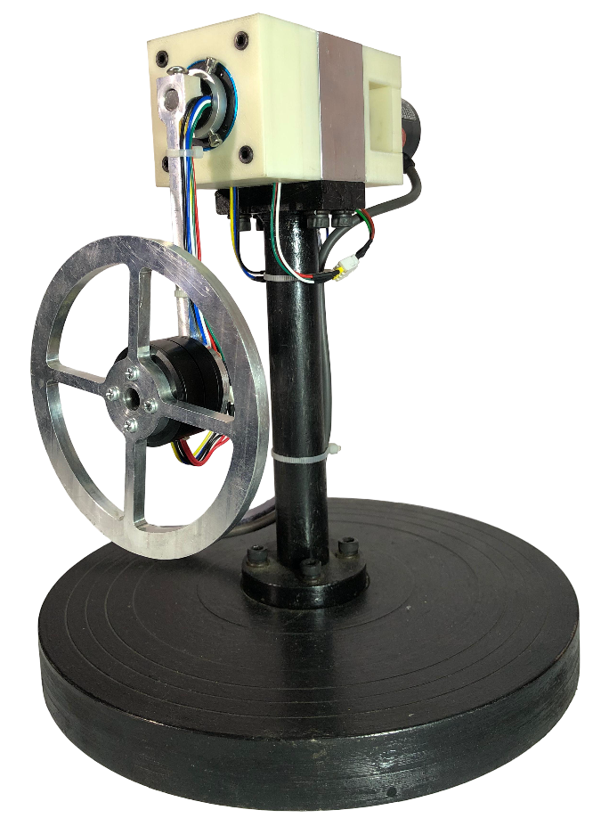
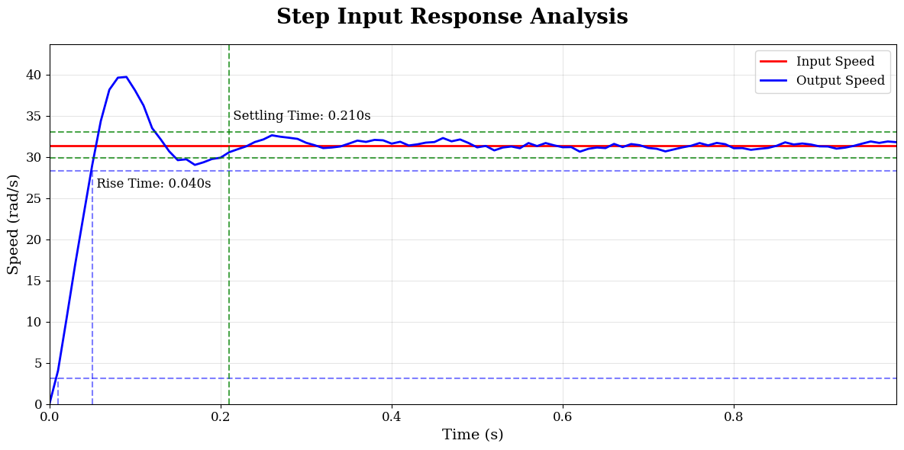
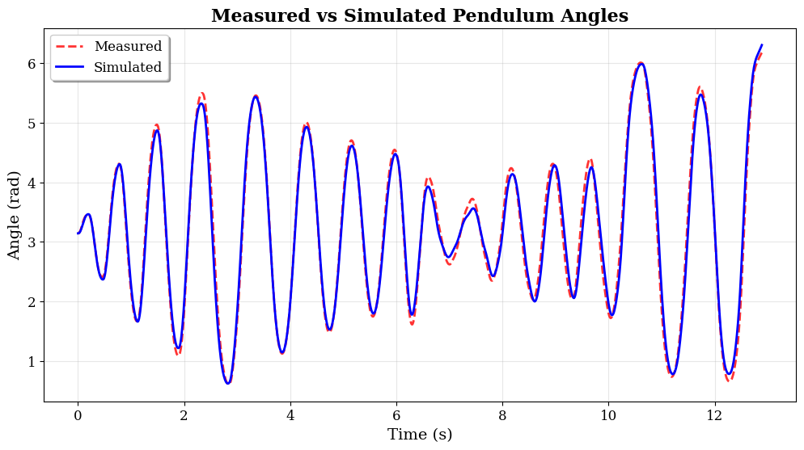
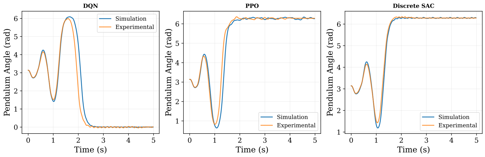
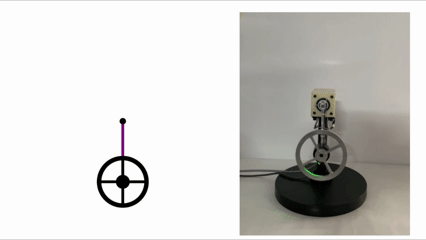

# Reaction Wheel Inverted Pendulum — Reinforcement Learning Control

An end-to-end implementation of a **Reaction Wheel Inverted Pendulum (RWIP)**, covering mathematical modeling, mechanical design, embedded communication, experimental system identification, reinforcement learning, and deployment of a learned neural-network controller on an **STM32F103**.

The project was developed to investigate whether a reinforcement-learning controller trained entirely in simulation could be transferred to a physical system using an accurately identified dynamic model.

---

## Project Overview

The development followed the following pipeline:

```text
Analytical Modeling
        ↓
Hardware Design & Manufacturing
        ↓
Data Acquisition
        ↓
System Identification
        ↓
Simulation
        ↓
Reinforcement Learning
        ↓
Neural Network Deployment
        ↓
Physical Hardware
```

The reaction wheel pendulum is an inherently unstable and under-actuated system. A BLDC motor drives the reaction wheel, producing a reaction torque that controls the pendulum indirectly.

---

## Hardware

The physical platform consists of:

- Reaction wheel inverted pendulum
- BLDC motor with closed-loop speed control
- Incremental optical encoder for pendulum position
- STM32F103 microcontroller
- CAN bus communication between the MCU and motor controller
- CNC-machined mechanical components
- 3D-printed mounting and cable-management components
- Slip-ring integration for the rotating assembly

The embedded system operates with a **100 Hz control loop**.

**Hardware:**
<p align="center">
  
</p>

---

## 1. Mathematical Modeling

An initial nonlinear model of the reaction wheel inverted pendulum was developed to analyze the system dynamics and guide the hardware design.

At this stage, the model was intentionally simplified. Friction and damping effects were initially neglected, and the motor torque was represented using a simplified model.

The model was simulated using Python and SciPy's **DOP853** numerical integrator.

The initial model was primarily used to:

- Analyze the system dynamics
- Determine suitable reaction-wheel parameters
- Evaluate motor requirements
- Guide mechanical design decisions

---

## 2. Hardware Design and Manufacturing

The physical RWIP was designed and manufactured based on the requirements obtained from the initial dynamic analysis.

The mechanical development included:

- CAD modeling of the complete system
- Reaction-wheel and motor selection
- Pendulum-arm design
- Shaft and bearing selection
- CNC machining
- 3D-printed component design
- Encoder integration
- Slip-ring integration
- Mechanical assembly and alignment

The design was iterated to balance mechanical stiffness, mass distribution, and the reaction wheel's moment of inertia.

---

## 3. Data Acquisition

After assembling the physical system, an embedded interface was developed to operate the motor and acquire experimental data.

The **STM32F103** communicates with the BLDC motor controller through **CAN bus** and interfaces with the pendulum encoder for position measurement.

A Python-based data-acquisition system was developed to:

1. Generate motor commands
2. Send commands to the embedded system
3. Record the resulting system response
4. Store experimental data in CSV format

The experimental data was subsequently used for system identification.

**Motor Response:**
<p align="center">
  
</p>

---

## 4. System Identification

The initial analytical model did not accurately capture the dynamics of the physical system. Effects such as friction, damping, additional mechanical components, and uncertainty in physical parameters needed to be incorporated.

Experimental data was therefore collected and used to estimate the dynamic parameters of the physical system.

### Motor Identification

The motor operates in closed-loop speed-control mode and was modeled using a second-order dynamic model.

Experimental excitation signals were used to characterize the motor response. A multi-level pseudo-random signal was selected to excite the system over a range of operating conditions.

The identification process consisted of:

- Experimental data collection at 100 Hz
- Nonlinear dynamic simulation using DOP853
- Squared-error objective function
- Parameter optimization using **L-BFGS-B**
- Validation using separate experimental data

### Pendulum Identification

The identified motor model was then incorporated into the pendulum model.

Experimental measurements of:

- Motor velocity
- Pendulum angle

were used to estimate the remaining pendulum parameters.

The resulting model provided a substantially more representative simulation of the physical system and formed the basis for reinforcement-learning training.

**System identification result:**

<p align="center">
  
</p>

---

## 5. Reinforcement Learning

A custom **Gymnasium-compatible environment** was developed using the identified nonlinear system model.

The agent observes the state:

$ s = [\theta, \dot{\theta},  \omega] $

where:

- $\theta$ — pendulum angle
- $\dot{\theta}$ — pendulum angular velocity
- $\omega$ — reaction-wheel angular velocity

The action space consists of **nine discrete motor-speed commands**, corresponding to positive, negative, and zero reaction-wheel speeds.

Each environment step advances the simulation by **10 ms (100 Hz)** using the DOP853 integrator.

Training in simulation provides a safe and computationally efficient alternative to directly exploring on the physical system.

### Algorithms

The project explored several deep reinforcement-learning approaches:

- **Deep Q-Network (DQN)**
- **Proximal Policy Optimization (PPO)**
- **Soft Actor-Critic (SAC)**

The learned policy was evaluated in simulation before being transferred to the physical system.

**RL results:**
<p align="center">
  
</p>

---

## 6. Neural Network Deployment

After training, the neural-network policy was deployed to the **STM32F103**.

The deployment pipeline was:

```text
PyTorch RL Policy
        ↓
Trained Neural Network
        ↓
Network Parameters / Model
        ↓
C Implementation
        ↓
STM32F103
        ↓
Real-Time Inference
        ↓
Motor Speed Command
        ↓
CAN → BLDC Motor
```

The embedded controller receives the measured system state, performs neural-network inference, and generates the corresponding discrete motor-speed command.

This allows the policy trained in simulation to run directly on the physical reaction wheel inverted pendulum.

---

## Demonstrations
**PPO: Simulation vs Experiment**
<p align="center">
  
</p>

---

## Repository Structure

```text
.
├── README.md
│
├── code/
│   ├── data_acquisition/
│   ├── reinforcement_learning/
│   └── agent_deployment/
│
├── figures/
│   ├── hardware.png
│   ├── motor_response.png
│   ├── system_identification.png
│   └── rl_results.png
│
└── videos/
    ├── dqn_sim_vs_real.mp4
    ├── ppo_sim_vs_real.mp4
    └── ppo_sim_vs_real.gif
```

---

## Project Outcome

The project resulted in a complete experimental platform in which:

1. A nonlinear physical system was modeled analytically.
2. A physical reaction wheel inverted pendulum was designed and manufactured.
3. An STM32F103-based embedded interface was developed for motor communication and sensor data acquisition.
4. Experimental data was used to identify the physical system.
5. The identified model was incorporated into a custom simulation environment.
6. Reinforcement-learning agents were trained in simulation.
7. A trained neural-network policy was implemented on the STM32F103.
8. The learned controller was evaluated on the physical system.